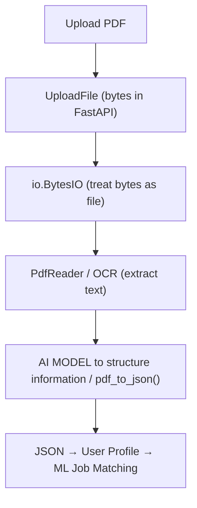

### Job Finder

#### NOTICES
Imp: The project is not completed. In the process


## Description

This project is a PDF parsing and information extraction tool that converts PDF files (including scanned/image-based PDFs) into structured JSON data. It uses OCR (Optical Character Recognition) via Tesseract to handle scanned documents and AI model such llama3 by using prompt to extract key information like names, email addresses, phone numbers, job titles, and countries.

FastAPI is used to receive uploaded files from users in main.py. Since, file is changed to bytes by Uploadfile type of FastApi.
The pdf_to_json() function is using io.BytesIO() to treat the the bytes input from Uploadfile as file. 

The tool is particularly useful for processing resumes/CVs, to generate profile. The profile information can be used to 
find jobs for the user using Machine Learning, user will be represent with available jobs.

## Features
- Extracts text from both text-based and image-based PDFs upload by user using FastApi
- Uses OCR (Tesseract) for scanned documents
- Extracts: Name,Email,Location,Job,Education,skills
- Outputs structured JSON data that will be represented as profile
- Handles various PDF formats and encodings




## Requirements

```bash
pip install -r requirement.txt
```

```bash
brew install ollama
```

```bash
ollama pull llama3
```

